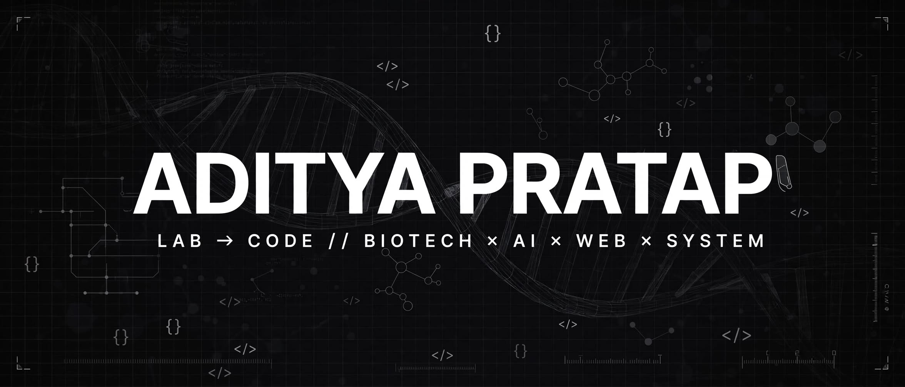

# ADITYA PRATAP

`GORAKHPUR, INDIA — OPEN TO WORK`

[Portfolio](https://my-portfolio-khaki-gamma-94.vercel.app) • [Email](mailto:adityapratap0077@gmail.com) • [Resume](./Resume.pdf)

---

### About

I'm **Aditya Pratap** — a Biotechnology undergraduate turned **Creative Technologist**. I bring the rigor of the lab — *hypothesis → experiment → iterate* — to building intelligent, editorial web experiences at the intersection of **AI, web, design, and science**.

> **B.Sc. Honors Biotechnology (5th Semester)**, Bundelkhand University, Jhansi
> **Independent builder since 2024** — AI-assisted development, modern web stacks, cinematic UI

---

### Tech Stack

---

### Flagship

| Project | What it is | Stack | Live |
|---|---|---|---|
| **[ASLI](https://github.com/adityapratap0077-cloud/asli)** | AI custom streetwear studio — describe a graphic, AI draws it, printed on demand in India | Next.js, TypeScript, Tailwind | [Demo](https://asli-delta.vercel.app) |
| **[BanaoBot](https://github.com/adityapratap0077-cloud/banaobot)** | No-code WhatsApp chatbot builder — auto-catalogue from a menu photo, Gemini AI brain, Hindi/English/Hinglish | Python, Flask, Gemini AI | [Demo](https://banaobot.onrender.com) |
| **[ReelForge](https://github.com/adityapratap0077-cloud/reelforge)** | Cinematic AI promo reels for local businesses — $40, 48-hour delivery | HTML, Tailwind, AI video | [Demo](https://reelforge-opal.vercel.app) |
| **[BizOS](https://github.com/adityapratap0077-cloud/bizos)** | Zero-cost business OS — leads, customers, tasks, bookings, invoices | Next.js, Supabase, TypeScript | [Demo](https://bizos-gamma.vercel.app) |
| **[PortfolioForge](https://github.com/adityapratap0077-cloud/portfolioforge)** | Portfolio generator — GitHub API import, 10 themes, auth-gated customize & download | JavaScript, GitHub API, Supabase | [Demo](https://portfolioforge-delta.vercel.app) |

---

### Built & Live

| Project | What it is | Stack | Live |
|---|---|---|---|
| **[BioVision Lab](https://github.com/adityapratap0077-cloud/biovision-lab)** | Interactive biology lab — DNA module, heart explorer, cell explorer, quiz | JavaScript | [Demo](https://biovision-lab.vercel.app) |
| **[AmplifyLab](https://github.com/adityapratap0077-cloud/amplifylab)** | PCR simulation for biotech learners | JavaScript | [Demo](https://amplifylab.vercel.app) |
| **[CulinaryCore](https://github.com/adityapratap0077-cloud/CulinaryCore)** | Premium recipe platform — meal planning, Pantry Chef AI | React, Tailwind, Node.js, Gemini | [Demo](https://culinarycore.vercel.app) |
| **[My-Portfolio](https://github.com/adityapratap0077-cloud/My-Portfolio)** | Cinematic personal portfolio with a full editorial design system | HTML, CSS, JavaScript | [Demo](https://my-portfolio-khaki-gamma-94.vercel.app) |
| **[Biotech Study Planner](https://github.com/adityapratap0077-cloud/aiims-biotechnology)** | Date-wise study planner — plans, revision tracking, mistake log, Gemini AI lab | TypeScript, Vite, Gemini AI | [Repo](https://github.com/adityapratap0077-cloud/aiims-biotechnology) |

---

### Concepts & Client Work

| Project | What it is | Stack | Live |
|---|---|---|---|
| **[Monumenta](https://github.com/adityapratap0077-cloud/Monumenta-heritage)** | AI heritage-restoration concept — restoring history's greatest treasures | HTML, CSS, JavaScript | [Demo](https://monumenta-heritage-adityapratap0077-cloud.vercel.app) |
| **[RamNayan Dairy](https://github.com/adityapratap0077-cloud/RamNayan-Dairy)** | Dairy brand website — products, heritage, trust | HTML, CSS, JavaScript | [Demo](https://ramnayan-dairy.vercel.app) |
| **[Aditya Crates](https://github.com/adityapratap0077-cloud/Aditya-crates)** | Digital-products storefront concept | Next.js, TypeScript | [Demo](https://aditya-crates.vercel.app) |
| **[The Busy Beginner Kitchen](https://github.com/adityapratap0077-cloud/the-busy-beginner-kitchen)** | Beginner cookbook concept site | HTML, CSS, JavaScript | [Demo](https://the-busy-beginner-kitchen.vercel.app) |
| **[Atelier](https://github.com/adityapratap0077-cloud/atelier-by-aditya-pratap)** | Design atelier concept | HTML, CSS, JavaScript | [Demo](https://atelier-by-aditya-pratap.vercel.app) |

---

### GitHub Stats

---

### Let's Connect

- **Email:** [adityapratap0077@gmail.com](mailto:adityapratap0077@gmail.com)
- **Portfolio:** [my-portfolio-khaki-gamma-94.vercel.app](https://my-portfolio-khaki-gamma-94.vercel.app)
- **Resume:** [Download PDF](./Resume.pdf)

*Open to internships, freelance projects, and collaborations at the intersection of tech & design.*
