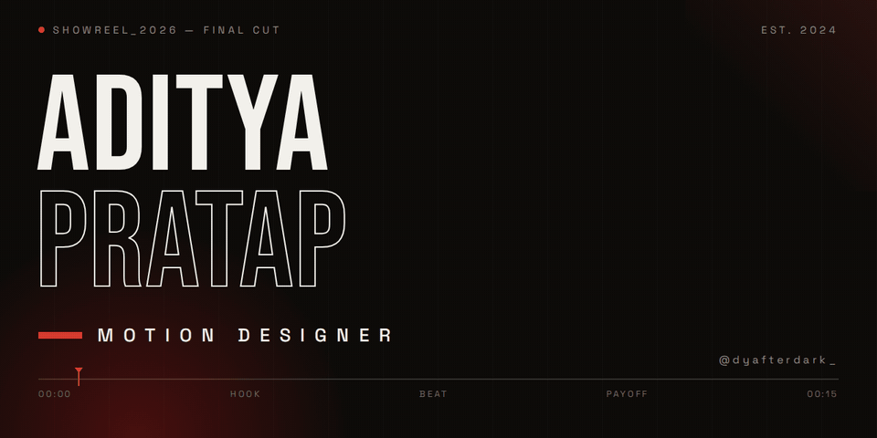
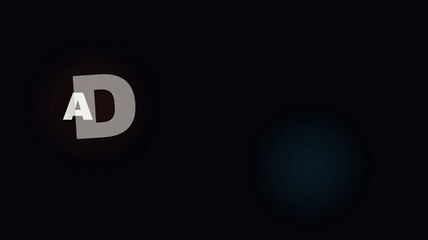
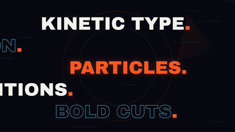
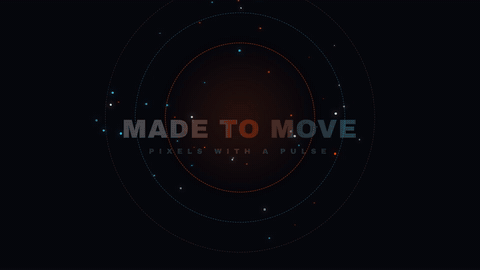

  
  
  

# ADITYA PRATAP

`GORAKHPUR, INDIA · OPEN TO WORK`

[Portfolio](https://my-portfolio-khaki-gamma-94.vercel.app) • [Showreel](https://my-portfolio-khaki-gamma-94.vercel.app#motion) • [Instagram](https://instagram.com/dyafterdark_) • [Email](mailto:adityapratap0077@gmail.com) • [Resume](./Resume.pdf)

### Selects

| `00:00` — the hook | `00:05` — the arsenal | `00:10` — the pulse |
|---|---|---|
|  |  |  |
| Name lands on the downbeat. | Three disciplines, one cut. | Type breathes with the track. |

<a href="https://my-portfolio-khaki-gamma-94.vercel.app#motion">Watch the full 15-second showreel</a>

---

### About

I'm **Aditya Pratap**, a **motion designer** who also ships real software. My day job is making brands felt in 3 seconds: shorts, UGC ads, and promo reels cut for the feed. My other day job is building the web products those brands live on.

I work in the 12 principles: anticipation before every reveal, easing on everything that moves, payoff in the first 3 seconds.

  
   <em>how everything I make moves</em>

> **Motion design studio:** VEYRO Motion & Visuals
>
> **Also:** B.Sc. Honors Biotechnology, Bundelkhand University (final year). The lab taught me process; the timeline taught me taste.

---

### What I do

- **Motion design**: shorts, UGC ads, promo reels, launch videos. Hook in 3 seconds or it doesn't ship.
- **Frontend builds**, editorial, cinematic websites. No templates, no AI slop.
- **AI products**, chatbots, tools, and utilities people actually open twice.

### Shipped & live

| Project | What it is | Live |
|---|---|---|
| **ReelForge** | AI promo-reel service, $40 reels, 48h delivery | [Site](https://reelforge-opal.vercel.app) |
| **BanaoBot** | WhatsApp chatbot builder for small businesses | [Site](https://banaobot.onrender.com) |
| **PortfolioForge** | GitHub username to portfolio website, 10 themes | [Site](https://portfolioforge-delta.vercel.app) |
| **SarkariRadar** | Every government scheme you're eligible for, in 60 seconds | [Site](https://sarkari-radar.vercel.app) |
| **AQI Alarm** | Live air quality for Indian cities, decision-first | [Site](https://aqi-alarm.vercel.app) |
| **Invertis Mart** | Student marketplace, buy, sell, request | [Site](https://invertis-mart.vercel.app) |

---

### More builds

| Project | What it is | Link |
|---|---|---|
| **ASLI** | AI custom streetwear studio, design your own garments | [Repo](https://github.com/adityapratap0077-cloud/asli) |
| **BioVision Lab** | Interactive biology lab, DNA, heart, cell explorers | [Demo](https://biovision-lab.vercel.app) |
| **CulinaryCore** | Premium recipe platform with Pantry Chef AI | [Demo](https://culinarycore.vercel.app) |
| **RamNayan Dairy** | Dairy brand website, products, heritage, trust | [Demo](https://ramnayan-dairy.vercel.app) |

---

### Stack

---

### GitHub stats

### Let's connect

- **Instagram:** [@dyafterdark_](https://instagram.com/dyafterdark_), motion design work, DMs open
- **Email:** [adityapratap0077@gmail.com](mailto:adityapratap0077@gmail.com)
- **Portfolio:** [my-portfolio-khaki-gamma-94.vercel.app](https://my-portfolio-khaki-gamma-94.vercel.app)
- **Resume:** [Download PDF](./Resume.pdf)

*Open to motion design work, internships, and freelance builds.*
